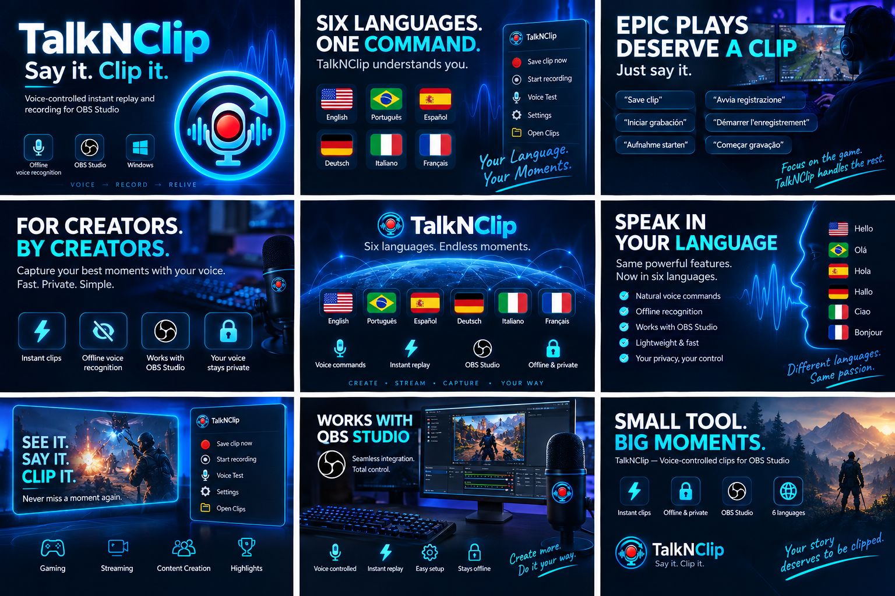

  

<h1 align="center">TalkNClip</h1>

  <strong>Say it. Clip it.</strong>

  Voice-controlled instant replay and recording for OBS Studio on Windows.

Offline voice recognition. No microphone audio is uploaded.

## What is TalkNClip?

TalkNClip lets you save an instant clip, start recording, and stop recording with your voice. It runs quietly in the Windows notification area and controls OBS Studio using your configured voice commands.

OBS handles video recording, audio mixing, the Replay Buffer, and output files. Configure your scenes and audio sources in OBS as usual.

## Features

- Save the last moments captured by the OBS Replay Buffer.
- Start and stop OBS recordings with custom voice phrases.
- Recognize commands offline in English, Portuguese, Spanish, German, Italian, and French.
- Test your phrases before using them to control OBS.
- Check OBS, microphone, recording, and replay status from the tray.
- Pause and resume voice control while keeping manual recording and clip controls available.
- Choose a light or dark settings window.

## Supported languages

The application interface and voice-recognition language are separate settings. For example, you can use the interface in Portuguese while speaking English commands. Both settings support all six languages below. Voice models are downloaded individually only when you request them.

| Language | Interface | Voice recognition | Official small Vosk model | Published WER |
| --- | --- | --- | --- | ---: |
| English (United States) | Yes | Yes | `vosk-model-small-en-us-0.15` | 9.85–10.38% |
| Português (Brasil) | Yes | Yes | `vosk-model-small-pt-0.3` | 32.60–68.92% |
| Español | Yes | Yes | `vosk-model-small-es-0.42` | 11.21–16.72% |
| Deutsch | Yes | Yes | `vosk-model-small-de-0.15` | 13.75–30.67% |
| Italiano | Yes | Yes | `vosk-model-small-it-0.22` | 16.88–25.87% |
| Français | Yes | Yes | `vosk-model-small-fr-0.22` | 19.30–27.25% |

Each range summarizes results from the [official Vosk model table](https://alphacephei.com/vosk/models). A lower WER means fewer errors only in a given benchmark. Vosk used different general-transcription datasets, so the values are not perfectly comparable and do not guarantee TalkNClip command accuracy. Use **Voice Test** with your own voice, microphone, and phrases before purchasing.

## How it works

1. Run TalkNClip in the system tray.
2. Choose your microphone and voice commands.
3. Connect TalkNClip to OBS Studio.
4. Say your configured phrase.
5. TalkNClip asks OBS Studio to save the clip or control recording.

## Get started

Requirements:

- Windows x64
- Microphone
- OBS Studio 28 or later

Instant clips require the OBS Replay Buffer to be running.

Follow the [getting started guide](assets/docs/getting-started.md) for setup details and to test your first command.

## Licensing

TalkNClip is sold as a one-time purchase with no subscription. It includes a lifetime license for the purchased version and supports up to two device activations.

Purchases and license management are handled through Freemius. Internet access is required for initial activation and periodic license validation. Enter your key in **Settings → License**; **Deactivate this computer** releases an activation after confirmation.

Your microphone audio is not sent to Freemius. Voice recognition runs locally after the selected voice model is installed, separately from licensing communication.

Do not publish or share your license key. For purchase, license, or account support, contact [talknclip.support@gmail.com](mailto:talknclip.support@gmail.com).

Read more in [TalkNClip licensing](assets/docs/licensing.md).

## Screenshots

### Settings

### Voice commands

### Voice test

### Tray controls

## Privacy

Speech recognition runs locally on your selected microphone. TalkNClip does not upload microphone audio or use cloud speech recognition. Model downloads and license activation or validation can require an internet connection.

Read [privacy and local data](assets/docs/privacy.md) for details about network access, logs, and support packages.

## TalkNClip at a glance

## Help and feedback

See the [support guide](assets/docs/support.md) for troubleshooting and how to report a problem through this repository's Issues tab.

This repository hosts the public documentation, screenshots, and issue templates for TalkNClip. Application source code is maintained separately.

See [third-party notices](assets/docs/third-party-notices.md) for component acknowledgments and the status of distribution notices.

Created by Fabio Carvalho.
